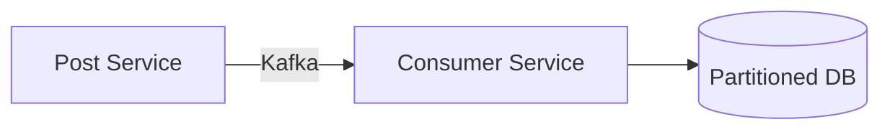
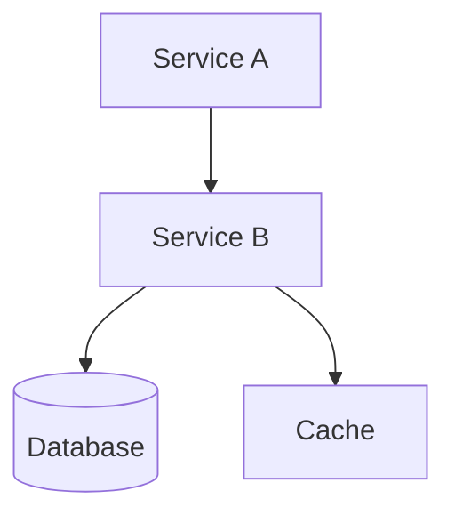
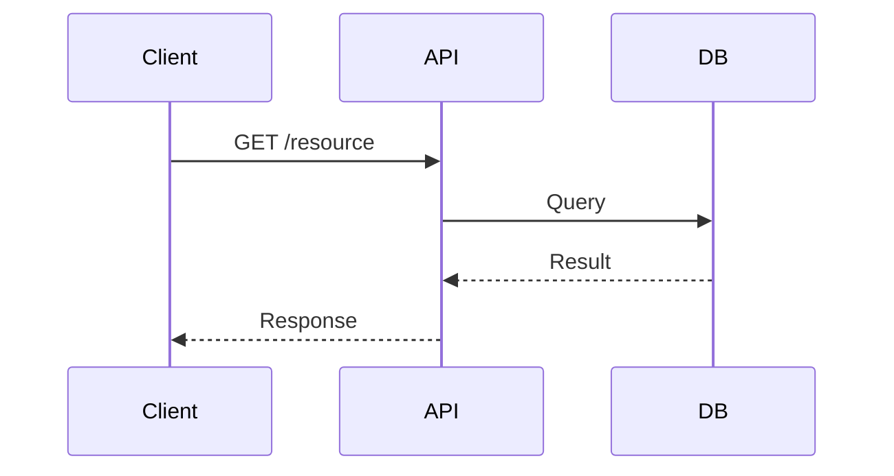

# Note Format Template (Lecture Notes)

Use this template when generating Obsidian lecture notes from Drive PDFs. Output goes under `Week {NN}/week-{NN}-{topic-slug}.md`. Add this frontmatter at the top:

```yaml
---
track: masterclass
week: NN
type: lecture-notes
source_pdf: "WW-SS.pdf"
session_day: friday | saturday | unknown
---
```

## Template Structure

```markdown
# {Topic Title}

## Overview

{1-2 sentence introduction explaining what this topic covers and why it matters.}

## {Main Section 1}

### {Subsection}
{Explanation with key points}

- **{Key term}**: Definition or explanation
- **{Another term}**: Definition or explanation

### {Subsection with Architecture Diagram}
{Context for the diagram}

```
┌──────────────┐     Kafka          ┌──────────────────┐
│ Post Service │────(TOPIC_NAME)───→│ Consumer Service │
└──────────────┘     part by key    └────────┬─────────┘
                                             │
                                    ┌────────▼─────────┐
                                    │  Partitioned DB  │
                                    └──────────────────┘
```



## {Main Section 2}

{Continue with logical flow of content}

## Real-World Examples

1. **{Example Name}**: {Brief description of how concept applies}
2. **{Example Name}**: {Brief description}

## Summary

- {Key takeaway 1}
- {Key takeaway 2}
- {Key takeaway 3}
- {Key takeaway 4}

---
*Source: System Design Pro by Arpit Bhayani*
```

## Diagram Guidelines

The slides are handwritten whiteboard notes full of architecture diagrams, flow diagrams, and data flow sketches. **Every diagram on the whiteboard must be captured in the notes.** Use ASCII art, Mermaid, or both.

### When to use ASCII art
- System architecture diagrams with boxes and arrows
- Data flow pipelines (Kafka → Service → DB)
- Comparison tables
- Index structures and data layouts

### When to use Mermaid
- Multi-step flows that benefit from automatic layout
- Sequence diagrams (request/response flows)
- Hierarchies and trees
- Anything that is hard to align in ASCII

### When to use both
When a diagram is central to the concept, provide both ASCII (for quick reading) and Mermaid (for rendered view in Obsidian). Place the ASCII version first.

### ASCII Box Characters
- Corners: `┌ ┐ └ ┘`
- Lines: `─ │`
- Connections: `├ ┤ ┬ ┴ ┼`
- Arrows: `→ ← ↑ ↓ ▶ ◀ ▲ ▼`

### Mermaid Syntax Quick Reference

**Flow diagram:**


**Sequence diagram:**


### Pseudocode blocks

When the whiteboard shows code or algorithms, transcribe them in fenced code blocks with `python` or appropriate language hint. Preserve the logic faithfully even if the handwriting has shorthand.

### Comparison tables

Use ASCII tables for trade-off comparisons shown on the whiteboard:

```
┌──────────────────┬───────────┬───────────┬────────────┐
│ Approach         │ Simplicity│ Speed     │ Efficiency │
├──────────────────┼───────────┼───────────┼────────────┤
│ Option A         │ High      │ Low       │ Moderate   │
│ Option B         │ Low       │ High      │ High       │
└──────────────────┴───────────┴───────────┴────────────┘
```

## Formatting Guidelines

### Headings
- **H1**: Topic title only (one per note)
- **H2**: Major sections (Overview, main topics, Summary)
- **H3**: Subsections within major sections
- **H4**: Rarely needed, use sparingly

### Lists
- Use bullet points for concepts and definitions
- Use numbered lists for sequences, steps, or ranked items
- Bold the key term before the colon: `- **Term**: Definition`

### Code Blocks
- Use for ASCII diagrams (plain ``` with no language)
- Use for pseudocode (```python or appropriate language)
- Use for Mermaid diagrams (```mermaid)

### Emphasis
- **Bold**: Key terms, important concepts
- *Italic*: Used sparingly for emphasis or foreign terms
- `Inline code`: Technical terms, file names, commands, API paths

### Links
- Internal Obsidian links: `[[Other Note]]`
- Use when referencing related concepts from this course

## Content Extraction Tips

When reading slide images:

1. **Identify the main topic** — Usually the title slide (page 0)
2. **Capture every diagram** — This is the most important content. Convert each whiteboard drawing to ASCII and/or Mermaid
3. **Group related slides** — Combine slides covering the same concept into one section
4. **Transcribe pseudocode faithfully** — Preserve the algorithm logic from whiteboard code
5. **Preserve brainstorm checklists** — These appear as checkbox lists on the whiteboard
6. **Build trade-off tables** — When the instructor compares approaches, capture as a table
7. **Include the key takeaways** — Usually listed on the final slides
8. **Synthesize, don't just transcribe** — Add context and connect concepts, but keep diagrams exact
